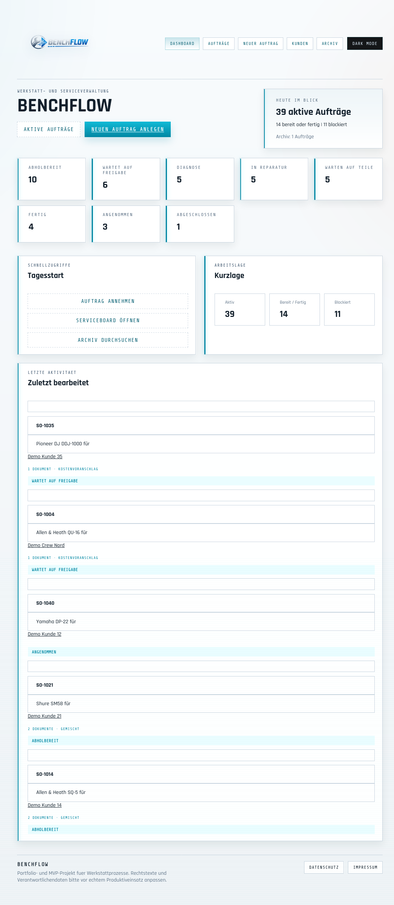
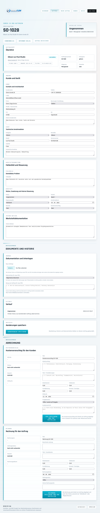
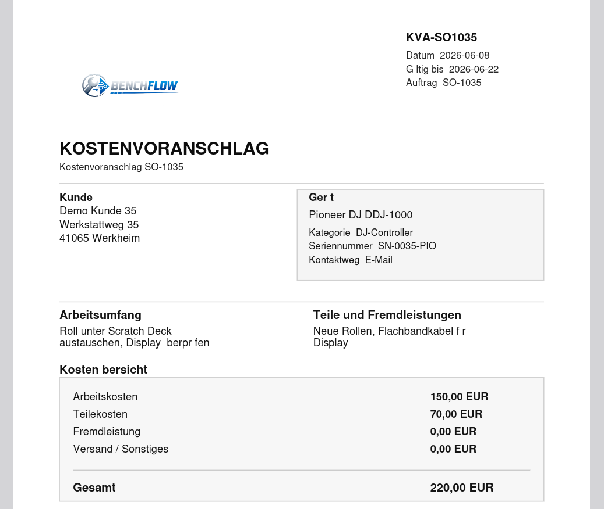

# 🔧 BenchFlow - Werkstatt & Service MVP


> **Ein praxisnahes Werkstatt- und Service-MVP für Reparaturprozesse. Kein generisches CRUD –
> sondern ein realistischer Ablauf für Annahme, Bearbeitung, Dokumentation, Kostenvoranschlag,
> Rechnung und Ausgabe. Inklusive nativer iOS-App (SwiftUI).**

---

## 🎬 Demo

### Dashboard

*Zentrale Übersicht mit Kennzahlen und Schnellzugriffen*

### Auftragsdetail

*Detailseite als Arbeitsbereich: Status, KVA, Rechnung, Anhänge in einem View*

### Nativer iOS-Client

*BenchFlow als iPhone-App – gleiche Daten, native SwiftUI-Oberfläche*

### PDF-Ausgabe

*Serverseitig erzeugter Kostenvoranschlag als druckfertiges PDF*

---

## ⚡ Quick Start

```bash
# 1. Repository klonen
git clone https://github.com/Matzorator/benchflow.git
cd benchflow

# 2. Virtualenv & Abhängigkeiten
python3 -m venv .venv
source .venv/bin/activate
pip install -r requirements.txt

# 3. App starten
python3 app.py
```

**Dann im Browser öffnen:** `http://127.0.0.1:5000` 🎉

> Für den nativen iOS-Client: siehe [`BenchFlowNative/README-Xcode.md`](BenchFlowNative/README-Xcode.md)

---

## ✨ Highlights

- 📋 **Echter Werkstattworkflow** – Annahme → Bearbeitung → KVA → Rechnung → Ausgabe
- 📄 **PDF-Erzeugung** – Kostenvoranschlag und Rechnung serverseitig als druckfertiges PDF
- 📱 **Native iOS-App** – SwiftUI-Client mit vollständiger API-Anbindung (Swift-Kurs-Projekt)
- 🔍 **Kundenmanagement** – Stammdaten, Suchfluss, Auftragshistorie
- 🗂️ **Dokumentenverwaltung** – Bilder & PDFs pro Auftrag, typisiert und umtypisierbar
- 🧪 **Getesteter Code** – `unittest`-Suite mit über 30 abgedeckten Flows

<details>
<summary>📋 Alle Features anzeigen</summary>

### 📋 Auftragsworkflow
- ✅ Dashboard mit Kennzahlen und Schnellzugriffen
- ✅ Eigene Listen für aktive Aufträge und Archiv
- ✅ Sortierung über Spaltenköpfe (ASC/DESC)
- ✅ Annahmefluss für neue Aufträge mit Kundensuche
- ✅ Detailseite als zentraler Arbeitsbereich pro Auftrag
- ✅ Statushistorie und Archivierung statt Löschen

### 👥 Kunden & Geräte
- ✅ Getrennte Kunden- und Gerätedaten
- ✅ Erweitertes Stammdatenmodell (Firma, Adresse, Kontaktweg, interne Notiz)
- ✅ Kundensuche direkt in der Auftragserfassung
- ✅ Kundenliste mit Suche und Aktivfilter
- ✅ Kundendetailseite mit Auftragshistorie
- ✅ Datenschutzkonformes Demo-Datenset (keine echten Personen)

### 📄 Dokumente & Anhänge
- ✅ Mehrere Bilder und PDFs pro Auftrag
- ✅ Dokumenttypen: KVA, Rechnung, Prüfprotokoll, Herstellerunterlage, Lieferschein, Servicebericht
- ✅ Nachträgliches Umtypisieren bestehender Dokumente
„Tech Enthusiast mit langjähriger Service-Erfahrung. Aktuell Fullstack-Weiterbildung: JS, React, Python, Swift, SQL. Ready für neue Challenges."


### 🖨️ Druck & PDF
- ✅ Kundenbeleg und interner Werkstattbeleg (druckoptimiert)
- ✅ Label-/Stickerbereich mit QR-Code
- ✅ Serverseitig erzeugter KVA als PDF
- ✅ Serverseitig erzeugte Rechnung als PDF
- ✅ KVA-Mailvorbereitung via `mailto:` mit vorausgefüllten Feldern
- ✅ Direkte KVA-zu-Rechnung-Übernahme mit Bestätigungsdialog

### 📱 Nativer SwiftUI-Client
- ✅ Vollständige iPhone-App (iOS 17+) mit REST-API-Anbindung
- ✅ Eigenes visuelles Design: dunkle Panels, Cyan-Akzente, flache BenchFlow-Navigation
- ✅ Alle Kernflows nativ: Aufträge, Archiv, Kunden, KVA, Rechnung, Anhänge
- ✅ Light/Dark-Mode mit Theme-Spiegelung in eingebettete WebViews
- ✅ XcodeGen-Projekt für reproduzierbares Xcode-Setup
- ✅ Fallback-Logik bei älteren API-Versionen

### 🌐 JSON-API
- ✅ REST-API als Bindeglied zwischen Flask-Backend und SwiftUI-Client
- ✅ Vollständige Abdeckung: Dashboard, Aufträge, Archiv, Kunden, KVA, Rechnung, Anhänge
- ✅ `/api/meta` liefert Picker-Optionen für Status, Kategorien, Hersteller, Dokumenttypen

### 🎨 UI (Web)
- ✅ Technischer Darkmode, zuschaltbarer Lightmode mit Persistenz
- ✅ Listenansicht für Desktop
- ✅ Toast-Benachrichtigungen statt statischer Flash-Boxen

</details>

---

## 🗺️ Roadmap

### 🎯 Version 1.0 (Aktuell)
- ✅ Vollständiger Auftragsworkflow
- ✅ KVA- und Rechnungsflow mit PDF-Ausgabe
- ✅ Dokumentenverwaltung mit Typisierung
- ✅ JSON-API für nativen iOS-Client
- ✅ SwiftUI-App (iOS 17+)

### 🔄 Version 2.0 (Geplant)
- 🔨 **Zahlungs- und Versandvermerke** bei Rechnungen
- 🔨 **SMTP-Mailversand** statt `mailto:`-Flow
- 🔨 **Firmen-/Ortsfilter** in der Kundenliste
- 🔨 **Erweiterte Dokumentenfreigabe** mit Genehmigungsprozess

---

## 🛠️ Tech-Stack

| Bereich | Technologie |
|---|---|
| Frontend | HTML, CSS, JavaScript (serverseitig via Flask/Jinja2) |
| Backend | Python + Flask |
| Datenbank | SQLite |
| Native App | Swift / SwiftUI (iOS 17+, macOS 14+) |
| Tests | Python `unittest` |
| Build (iOS) | XcodeGen (`project.yml`) |

---

## 🌐 API-Übersicht

| Endpunkt | Beschreibung |
|---|---|
| `/api/meta` | Picker-Optionen (Status, Kategorien, Hersteller, Dokumenttypen) |
| `/api/dashboard` | Kennzahlen und zuletzt bearbeitete Aufträge |
| `/api/orders`, `/api/orders/<id>` | Auftragsliste und Auftragsdetail |
| `/api/archive` | Archivierte Aufträge |
| `/api/orders/<id>/quote` | KVA-Daten lesen und speichern |
| `/api/orders/<id>/invoice` | Rechnungsdaten lesen und speichern |
| `/api/orders/<id>/quote/email` | Vorbereiteter Mailflow für KVA |
| `/api/orders/<id>/attachments` | Bild-/PDF-Anhänge verwalten |
| `/api/customers`, `/api/customers/<id>` | Kundenliste und Kundendetail |

---

## 🌐 Web-Routen

| Route | Beschreibung |
|---|---|
| `/dashboard` | Übersicht |
| `/orders` | Aktive Aufträge |
| `/orders/new` | Neuer Auftrag |
| `/orders/<id>` | Auftragsdetail |
| `/archive` | Archivierte Aufträge |
| `/customers` | Kundenliste |
| `/customers/<id>` | Kundendetailseite |
| `/orders/<id>/print` | Kundenbeleg |
| `/orders/<id>/print/internal` | Interner Beleg |

---

## 📁 Projektstruktur

```
benchflow/
│
├── app.py                      # App-Einstiegspunkt
├── requirements.txt
├── README.md
│
├── app/„Tech Enthusiast mit langjähriger Service-Erfahrung. Aktuell Fullstack-Weiterbildung: JS, React, Python, Swift, SQL. Ready für neue Challenges."


│   ├── __init__.py
│   ├── routes.py               # Flask-Routen, PDF-Erzeugung, Workflow-Logik
│   ├── api.py                  # JSON-API für den SwiftUI-Client
│   ├── db.py                   # DB-Zugriff, Migrationen, Seed-Daten
│   ├── schema.sql              # SQLite-Schema
│   ├── static/
│   │   └── styles.css          # Theme, Layout, Print-Styling
│   └── templates/              # Jinja2-Seiten und Druckansichten
│
├── tests/
│   ├── test_app_flows.py       # Kernfluss-Tests
│   └── test_api_flows.py       # API-Tests
│
├── BenchFlowNative/            # SwiftUI-App
│   ├── project.yml             # XcodeGen-Konfiguration
│   ├── README-Xcode.md         # Startanleitung für Xcode
│   └── BenchFlowNative/        # Quellcode: APIClient, Models, ViewModels, Views
│
└── instance/                   # SQLite-Datenbankdatei (lokal, nicht versioniert)
```

---

## 🧪 Tests

```bash
python3 -m unittest discover -s tests -p "test_*.py"
```

Optionaler Syntax-Check:

```bash
python3 -m compileall app.py app tests
```

<details>
<summary>📋 Abgedeckte Test-Flows</summary>

- ✅ Auftrag anlegen und aktualisieren
- ✅ Kundenübernahme in der Erfassung
- ✅ Kundenliste und Kundenfilter
- ✅ Kundendetailseite
- ✅ Bild- und PDF-Anhänge
- ✅ Dokumenttypen und Dokumenthinweise
- ✅ KVA-Workflow
- ✅ Vorbereiteter KVA-Mailflow
- ✅ Rechnungsworkflow
- ✅ Archivieren und Wiederherstellen
- ✅ Kunden- und interner Beleg
- ✅ JSON-API: Dashboard, Auftragsdetail, Kundenliste, KVA/Rechnung, Attachment-Upload

</details>

---

## ⚠️ Bekannte Grenzen

- Mailversand ist bewusst ein vorbereiteter `mailto:`-Flow, kein SMTP-Versand
- KVA und Rechnung können bei Bedarf um weitere kaufmännische Pflichtangaben erweitert werden
- Die Test-Suite ist pragmatisch und nicht als vollständige Integrationsabdeckung gedacht

---

## 🤝 Contributing

Beiträge sind willkommen!

1. Fork das Repository
2. Branch erstellen (`git checkout -b feature/NeuesFeature`)
3. Commit (`git commit -m 'Add: Neues Feature'`)
4. Push (`git push origin feature/NeuesFeature`)
5. Pull Request öffnen

---

## 📄 License

MIT License – siehe [LICENSE](LICENSE) Datei

---

## 💡 Entstehung und Arbeitsweise

BenchFlow ist ein Eigenprojekt im Rahmen meiner Weiterbildung zum Fullstack Webentwickler.

Das Projekt wurde eigenständig konzipiert, strukturiert und entwickelt.
Bei der Umsetzung habe ich gezielt KI-gestützte Werkzeuge (u.a. als Pair-Programmer,
für Code-Reviews und zur Klärung technischer Fragen) eingesetzt – ähnlich wie
Entwickler heute Linter, Dokumentation oder Stack Overflow nutzen.

Alle Architekturentscheidungen, der Workflow-Entwurf und das Debugging
lagen durchgehend bei mir.

---

## 📬 Kontakt

**Matthias Osypka**

[](mailto:mosypka@tutamail.com)
[](https://github.com/Matzorator)

💡 **Suche nach:** Entwickler Position im Bereich Fullstack Web Entwicklung

---

## 📊 Projekt-Statistik

```
Stack:              Python · Flask · SQLite · Swift · JavaScript
Test-Flows:         30+
API-Endpunkte:      12+
Dokumenttypen:      6
Unterstützte OS:    macOS (Web) · iOS 17+ (Native)
```

---


[⬆ Nach oben](#-benchflow---werkstatt--service-mvp)

</div>
